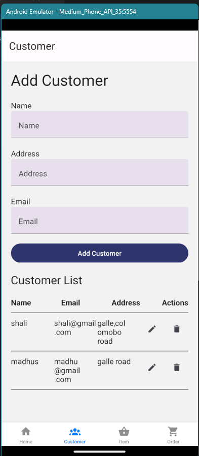
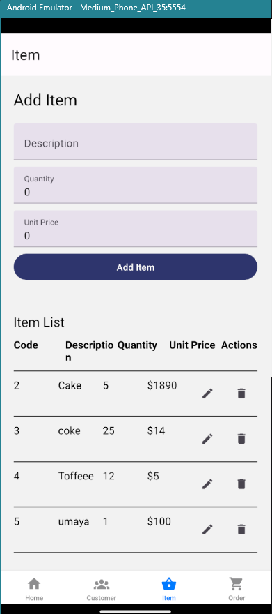

# React Native Android App with Tab Navigation

This is a simple React Native application demonstrating how to set up tab navigation using React Navigation. The app will have a basic tab navigation layout for Android.

## Prerequisites

Before starting, make sure you have the following installed:

- **Node.js**: [Install Node.js](https://nodejs.org/)
- **React Native CLI**: [Install React Native CLI](https://reactnative.dev/docs/environment-setup)
- **Android Studio**: [Install Android Studio](https://developer.android.com/studio)
- **Expo CLI (optional)**: [Install Expo CLI](https://docs.expo.dev/get-started/installation/)
  
-  **Customer Mobile View Screenshot**:
- 
- **Item Mobile View Screenshot**:
- 
